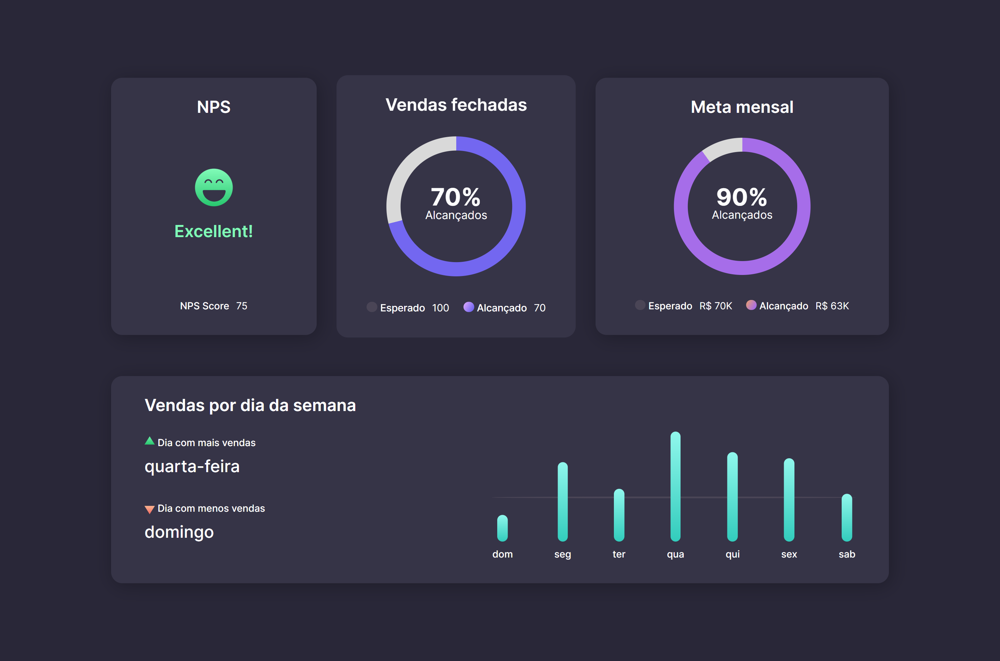

<h1 align="center"> Dashboard - BoraCodar#8 </h1>

[Clique aqui para acessar](https://maik-emanoel.github.io/dashboard/)

## 🚀 Tecnologias

Esse projeto foi desenvolvido com as seguintes tecnologias:

- HTML
- CSS
- JavaScript
- Git and GitHub

## 💻 Projeto

Neste mini dashboard podemos ver várias informações de resultados de vendas e metas de uma empresa.  

Obs: Projeto construído a partir do layout proposto no desafio [#BoraCodar7](https://boracodar.dev/) realizado pela [Rocketseat](https://rocketseat.com.br).
Após o desenvolvimento do projeto inicial, adicionei novas features, tais quais:

- Uma barra circular de progresso dinâmica
- Layout responsivo (Adaptado para telas menores)
- Efeito hover nos cards
- Animação ao carregar a página
- Entre outras pequenas mudanças.